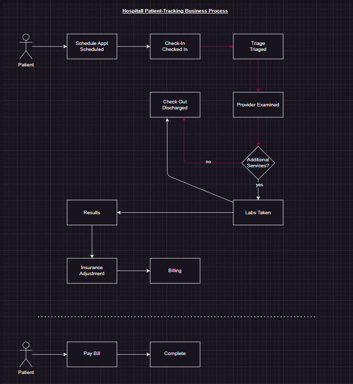

# Business Process Tracking using Azure Integration Environments (Preview)

This repository serves as a Level Up reference and lab for learning how to monitor business processes using [Azure Integration Environments (Preview)](https://learn.microsoft.com/en-us/azure/integration-environments/overview).

## Table of Contents
- [Business Scenario](#business-scenario)
- [Azure Services Leveraged](#azure-services-leveraged)
- [Repo structure](#repo-structure)
- [Getting Started](#getting-started)

## Business Scenario
This is the Contoso American hospital visit and patient management system. In the USA, patients often will have their services billed to insurance to have their liability adjusted, and then the remainder of what insurance does NOT cover will be the responsibility of the patient to cover.

Integraton events are used to manage patient visits and patient information.

### Business Process 

## Azure Services Leveraged
To follow along with the Level Up or on your own in the lab, a basic understanding of the following Azure resources is recommended:

- [Logic Apps](https://learn.microsoft.com/en-us/azure/logic-apps/)
- [Azure Service Bus](https://learn.microsoft.com/en-us/azure/service-bus-messaging/)
- [Azure Integration Environment](https://learn.microsoft.com/en-us/azure/integration-environments/)

## Repo structure
The repository has the following folder structure:

- `src`: Contains the source code files.  This is the fictional hospital tracking system.
- `docs`: Contains the documentation files which include the content needed to do the lab, presentation materials, and testing.
- `infra`: Contains the infrastructure files.
- `scripts`: Contains scripts to help you check requirements and for AZD to leverage

## Getting Started
Lab instructions are provided in the [docs/labs](./docs/labs/readme.md) folder.
