# Business Process Tracking Lab Instructions

Follow along below for step-by-step instructions on how to complete the Business Process Tracking Lab.

## Table of Contents

- [Step 0: Important Infrastructure and Prerequisites](#step-0-important-infrastructure-and-prerequisites)
- [Step 1: Provision the Azure Integration Environment](#step-1-provision-the-azure-integration-environment)
- [Step 2: Create an Application and Link Resources](#step-2-create-an-application-and-link-resources)
- [Step 3: Create Business Processes](#step-3-create-business-processes)
- [Step 4: Testing](#step-4-testing)
- [IaC Note](#iac-note)

## Step 0: Important Infrastructure and Prerequisites

Before we can begin please confirm that you have completed the following prerequisites:

[** Mandatory: you must have the infrastructure deployed before you can begin this lab.**](/docs/labs/readme.md)

## Step 1: Provision the Azure Integration Environment

In this step we will provision the Azure Integration Environment. This is the environment that will be used to host the business processes and resources for the Contoso Hospital Patient-Tracking Application. We will do all of this in the Azure Portal in the subscription and resource group you created during the provisioning of the infrastructure.

1. Open the Azure Portal and navigate to the resource group you created during the infrastructure deployment.  

    At the time of this lab, the resource is called "Integration Environment Preview". Do not confuse it with other like-named resources (Integration Service Environment, etc.).

2. Click on the "Create" button to add a new resource.

    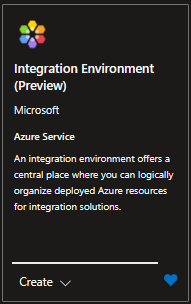

3. Search for "Integration Environment" and click on the "Create" button.

4. Fill in the required fields and click "Create". You can use the following values:
    - Subscription: Select your subscription from the drop-down
    - Resource Group: Select your resource group from the drop-down
    - Name: Give it a name like ```ie-hospital-levelup```
    - Region: Match the region of your resource group if possible

    It should look similar to this:

    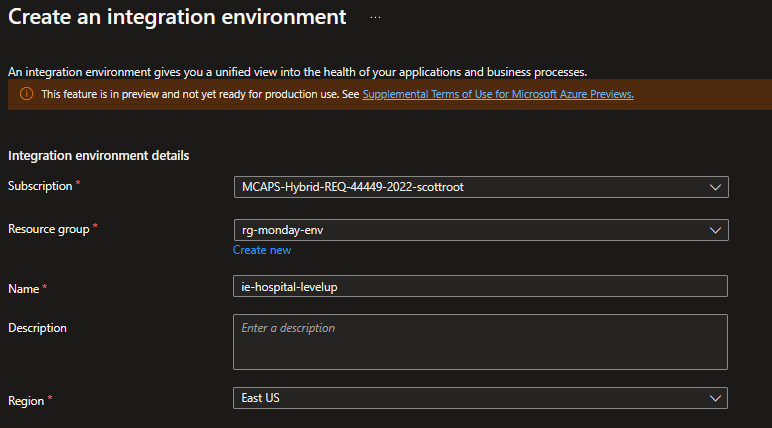

5. Wait for the deployment to complete. This can take a few minutes.

## Step 2: Create an Application and Link Resources

Navigate to the Applications link under the Environment heading on the left hand side within your Integration Environment
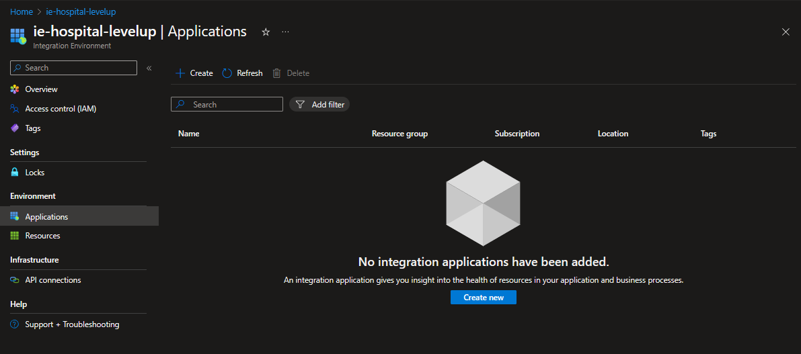

- Provide a name for the application like ```patient-tracking```
- Click Next:Resources
- Click Add resource
  - Select the resource type "Logic App"
  - Select the logic app standard resource you created in the provision steps, click 'Add'
        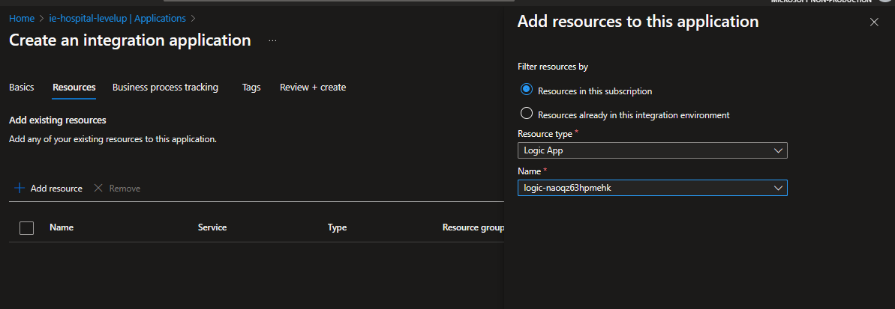
  - Do the same thing to add the Service Bus resource and queues you created in the provision steps
        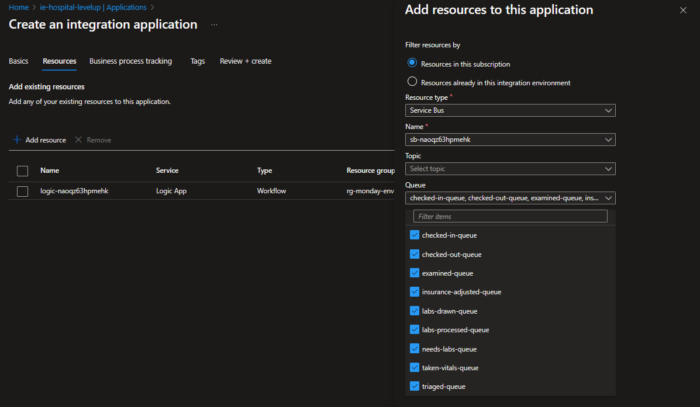
  - You should now see your resources as part of the application
        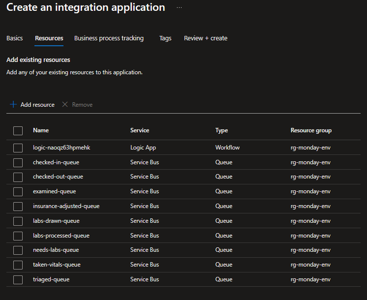

The provisioning steps created an Azure Data Explorer cluster and a database that will be used to track the progress of said business processes.

- Select your values from the three drop downs based on your infrastructure deployment:

    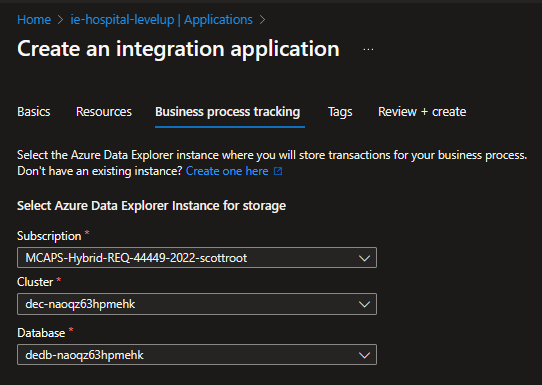

- Add any tags you want to use for your own orgranization or billing purposes.

- Click Review + Create and then Create to create the business process tracking application resource.

## Step 3: Create Business Processes

- In this step we will create the business processes that will be used to track the patient workflow. We will do this in the Azure Portal in the subscription and resource group you created during the provisioning of the infrastructure.

    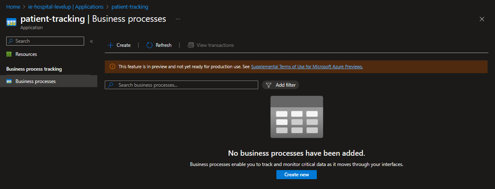

- Add a name for the business process like ```patient-visit-process```
- Specify the name of a ```business identifier``` that will be used to track the process.  This could be an Appoinment ID or some other unique identifier.  We will use ```appointment_id```
    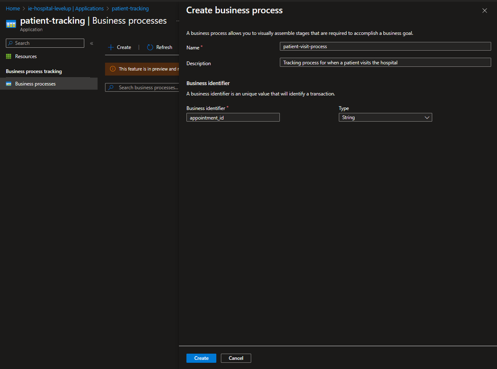

- Click in to the business process we just created to see a visual representation of the process.

- In the flyout on the right give this stage a name like ```Check-In```
- Click the checkbox next to ```show data source``` to map the attributes of the business process to the attributes of the logic app we created in the previous step.

- Over in the linked Logic App designer you will be able to map your attributes to the business ID we identified in the previous step which we called ```appointment_id```.
  - Select the last step ```response``` in the logic app to have access tot he state of all attributes and variables.
  - In the Business ID field click the lightning bolt and select the ```appointment_id``` attribute from the logic app.
        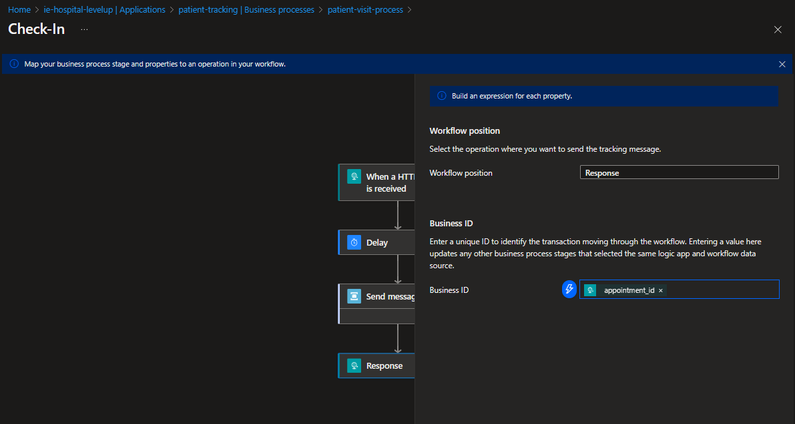
  - Click continue to go back to the business process designer.
  - Your stage definition should now look similar to this:
        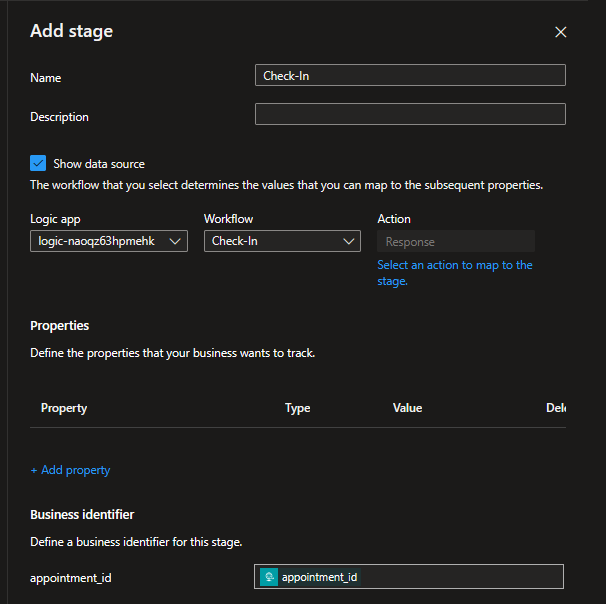
  - Click 'Add'

### Repeat the above steps to create the following stages

Now complete the same steps to create the following stages clicking the ```save``` icon after each stage is created. You can create parellel branches by selecting to add another stage after Examination and select Add Parallel Stage.

- ```Triage```
- ```Take-Vitals```
- ```Examination```
- Parallel BRANCH for ```Check-Out``` and ```Draw-Labs```
- Underneath ```Check-Out``` create stages for
  - ```Insurance```
  - ```Billing```
  - ```Payment```
- Underneath ```Draw-Labs``` create stages for
  - ```Process-Labs```
  - ```Evaluate-Results```

Your business process should now look similar to this:

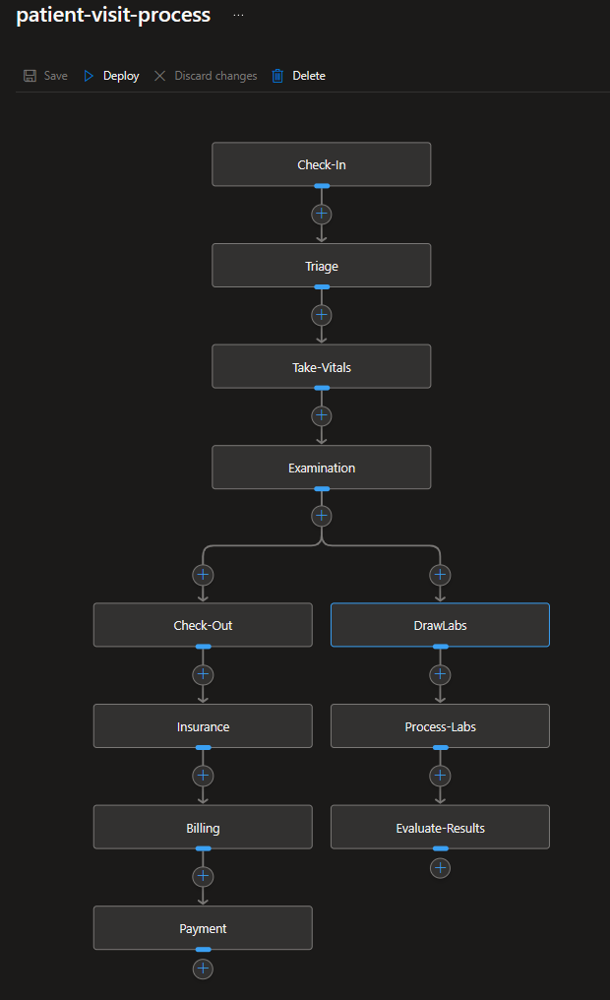

- Once you are finished setting up the stages to monitor the business process, click the Deploy button. This will push everything into your ADE database and start tracking the processes as they happen.

## Step 4: Testing

There is a test script that you can leverage in the [API Calls](../../API%20Calls/) folder of this repository. It does require the use of the REST Client extension in Visual Studio Code. You can use the script to simulate the patient workflow and see the business process tracking in action.

- Before you test, make sure that your Azure Data Explorer Cluser is running. Policy may shut it down after inactivity if you have created the resource in the past.  

  - You can check this by navigating to the resource in the Azure Portal and clicking on the "Data Explorer" link in the left hand menu. If it is not running, click the "Start" button at the top of the page.

- [HTTP Testing Script is here](<../../API Calls/Full-Test.http>)

Using this basic testing script, you will need to provide two URLs to your logic apps so that you may trigger them via HTTP.

Recall that the business process runs primarily off of Azure Service Bus Queue triggers so the only entry points you have to manually interact with this process is to begin everything via ```Check-In``` and to execute the ```payment``` endpoint to close the process.  

- Getting your logic app endpoints to use in the testing script:
  - Navigate to the logic app standard resource in the Azure Portal
  - Click on the Check-In workflow
  - Copy the Workflow URL from the trigger
  - Paste it into the testing script for the line ```@CheckInURL = [your check-in URL here]```
  - Go back to the portal and Do the same for the payment endpoint making sure you grab the proper Workflow URL from the ```Payment``` workflow overview page.
  - Paste it into the testing script for the line ```@PaymentURL = [your payment URL here]```

        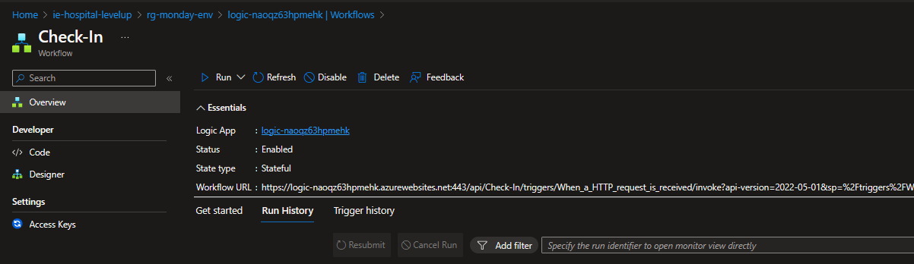

    - Note that the ```appointment_id``` variable is dynamically generated in the script so you don't have to worry about that.  It is used to simulate a unique identifier for the patient visit.
    - Once you have your values substituted for the placeholders, click on the ```Send Request``` text above the POST line to trigger the ```Check-In``` workflow
        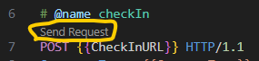

    - Observe the business process tracking application in the Azure Portal to see the process move through the stages as you trigger the workflows.
    - Note: there is a random chance for the logic app flow to head down the labs path, so you may want to run multiple processes to see the different paths.

        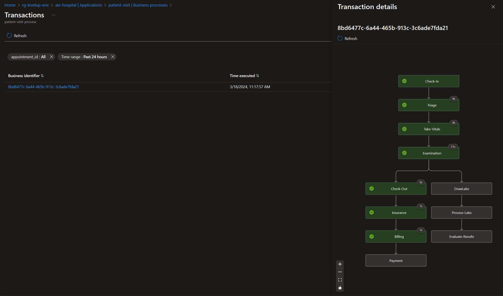

    - Complete the payment process by calling the payment endpoint in the testing script.
    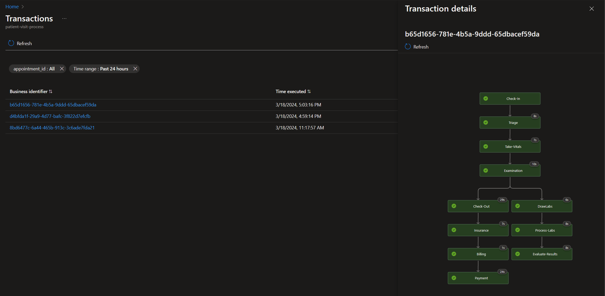

### Note

This was done intentionally to illustrate a manual step in the process in where the patient would pay for their services after everything else has been completed.

**Note: this illustrates that there are NO resources 'waiting' for the patient to pay. The process just has not reached that step yet. There is no long running process that is waiting for days/weeks, just rather a guid in ADE that does NOT have the last step... until it does.

## IaC Note

You may be asking yourself: "why we are creating all of this in the portal and not via IaC?". The answer is that the Azure Integration Environment is a new service and the IaC support is not yet available. We are working on it and will update this lab when it is available. There is also some value in visually seeing how things are linked together in the portal. This is especially true for the business process tracking application.
