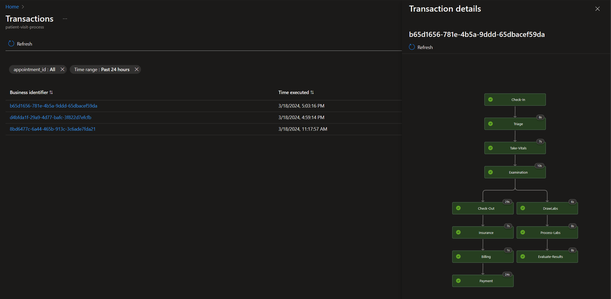

# Presentation Script

The goal of this script is to help anyone who wants to facilitate this as a presentation or workshop. It's designed to be a guide to help you understand the key points and steps to follow. It's not meant to be read verbatim, but rather to be used as a guide to help you understand the key points.

## Steps to follow / show

Follow along below as a facilitator.  The goal is to show the audience how to get started with the solution and how to build and deploy it.  The demo/lab itself *should* be self-explanitory.

### Laying the foundation

- Show how to get to this repository and fork / clone
- Show how to run the prerequisites scripts
- Show VS Code and what the folder structure looks like
- Demo a few of the key extensions / features
    - Logic Apps Designer
    - Bicep (show infrastructure as code pieces)
    - AZD (Azure Developer CLI)
        - Discuss the value of AZD
        - Mention how environment setup is done and then used for the rest of the lab
    - Mention github actions 

### Building the solution

- Show the solution in the `src` folder
- Walk through the `azd` commands and deploy
    - Create a new environment, login, etc.
    - Do the `azd up` command but don't wait for deployment to end it takes a long time
        - Show a previous deployment in the portal
- Continue on with the lab by creating each of the steps of the project via the IE stages and linking of important attributes.

The final result should look like this:
